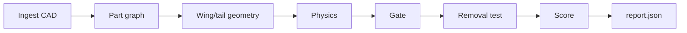

# DroneBench — Spec

*Sep 19, 2026*

DroneBench scores small electric fixed-wing UAV designs, checks they fly, and explains every part. It never suggests changes: an outside agent edits the design and re-scores to climb.

## Scope and inputs

- **In:** electric fixed-wing, 1–3 m span. Reference design: Titan Dynamics Falcon V2.
- **Out:** suggestions, suppliers, prices, cost (recommender side), agent training.

```
design/
  cad/          # STEP, STL, 3MF, OBJ or GLB; one body per part
  bom.yaml      # part info, one entry per CAD body
  mission.yaml  # locked payload parts + preset
```

`bom.yaml` entry (matched to CAD by filename or body name):

```yaml
- id: motor_L
  cad: motor_L.stl
  part_number: BrotherHobby 2816 620KV
  type: motor   # motor|prop|esc|battery|servo|fc|rx|gps|spar|wing|fuselage|tail|surface|hinge|linkage|fastener|payload|other
  material: {name: steel/Al}        # printed: {name: LW-PLA, infill: 0.15, walls: 2}
  specs: {kv: 620, rm_ohm: 0.061, i0_a: 0.9, imax_a: 35, mass_g: 128}
  locked: false  # true = mission payload, cannot be removed
```

## Pipeline



- **Ingest:** each CAD body becomes a mesh (trimesh): volume, bounding box, CG, contacts.
- **Part graph:** bodies joined to BOM entries. Edges are physical (bolted, bonded, hinged, press fit) and electrical (battery→ESC→motor, FC→servo).
- **Geometry:** slice wing and tail for span, area, chord, sweep, dihedral, airfoil (matched to UIUC), tail arm, tail volume.
- **Physics:** analytic, under 100 ms per run.
- **Gate:** universal pass/fail checks.
- **Removal test:** per part and per fastener group.
- **Score:** the chosen preset.
- **Report:** JSON with per-part detail.

## Score and gate

Score is physics only, has no ceiling, and is 0 if the gate fails. The gate is the same for every design. Each failure returns the check, the value and the limit.

| Preset | Score (higher is better) |
|---|---|
| endurance | minutes at best-endurance speed |
| range | km at best-range speed |
| speed | max level speed, km/h |
| payload | payload mass / all-up mass |
| efficiency | km per Wh at cruise |

| Check | Pass if |
|---|---|
| Static margin | 5–20% of mean chord |
| Stall | cruise ≥ 1.3 × stall speed |
| Climb | ≥ 2 m/s at max weight |
| Spar | safety factor ≥ 1.5 at 3.5 g |
| Tail volume | horizontal 0.35–0.7, vertical 0.02–0.06 |
| Servos | torque ≥ 1.5 × hinge moment at max speed |
| Motor, ESC, battery | current ≤ rating (C rating for battery) |
| Chains | battery→ESC→motor→prop; FC→RX; FC→every surface servo |
| Payload | every locked part present |
| Clearance | no part overlaps; prop clears airframe |

## Physics and necessity

- **Aero:** drag polar = CD0 (component build-up) + induced drag (aspect ratio, Oswald e). Airfoil polars from XFOIL/UIUC. Neutral point from AVL.
- **Propulsion:** motor model (KV, Rm, I0), APC/UIUC prop data, battery discharge.
- **Structure:** spar as a cantilever beam; printed skins count as non-structural.
- **Error band:** ±15%, stated in every report.
- **Acceptance test:** Falcon V2 at 3.5 kg must give 1.6 Wh/km ±15%. A hand check already gives 1.29–1.73 Wh/km over 45–65 km/h.

**Removal test:** remove the part (or fastener group) in a copy, rerun gate and score.

| Result | Meaning |
|---|---|
| required | gate fails; reason = the failing check |
| helpful | gate passes, a margin drops; before/after shown |
| unnecessary | gate passes, score rises; gain shown |

## Output

Every value carries its source: `bom`, `cad`, `computed`, `inferred` or `assumed`. This is what the recommender consumes.

Materials, every part, no blanks:

- **Printed:** filament, infill, walls, print orientation, density.
- **Bought:** main materials per sub-part (motor: Al bell, steel shaft, Cu windings, NdFeB magnets; spar: carbon fiber; battery: Li-ion/LiPo cell chemistry).
- **Missing from the parts list:** inferred from part type and CAD density, tagged `assumed`.

```json
{
  "score": {"preset": "endurance", "value": 94.2, "error_band": 0.15},
  "gate": {"pass": true, "checks": [{"name": "static_margin", "value": 0.11, "limit": [0.05, 0.2], "pass": true}]},
  "aircraft": {"mass_g": 3480, "span_m": 2.093, "area_m2": 0.4514, "stall_kmh": 35, "cruise_kmh": 55, "wh_per_km": 1.43},
  "parts": [{
    "id": "motor_L", "part_number": "BrotherHobby 2816 620KV", "type": "motor",
    "function": "propulsion", "why": "drives prop_L; 1 of 2 thrust sources",
    "necessity": "required", "removal_test": "gate fail: climb 0.4 m/s < 2.0",
    "specs": {"kv": 620, "imax_a": 35, "mass_g": 128},
    "material": {"name": "steel/Al", "source": "bom"},
    "interfaces": [{"mates": "nacelle_L", "type": "bolt pattern 4xM3", "tolerance": "±0.1 mm", "source": "inferred"}],
    "operating_point": {"cruise_a": 4.2, "limit_a": 35, "margin": 8.3},
    "regulations": ["FAA Part 107: aircraft ≥ 250 g needs registration + Remote ID"],
    "confidence": 1.0
  }]
}
```

## Agent-supplied parts and interface

A swap may bring a new BOM entry and CAD file. Values that fail these checks are clamped and flagged `agent_supplied_clamped`:

- LiPo ≤ 200 Wh/kg; Li-ion ≤ 270 Wh/kg
- Motor power per gram within its size class
- KV, voltage and prop size consistent
- Mass from CAD geometry when given, not from the claim

CLI:

```bash
dronebench score design/ --preset endurance   # report.json to stdout, appends runs.jsonl
dronebench parts design/                       # per-part report only
dronebench view  design/                       # three.js viewer, parts colored by necessity
```

Python API:

```python
env = DroneBench("design/", preset="endurance")
obs = env.reset()
obs, reward, done, info = env.step(edit)   # reward = score change
```

## Demo, build order, open items

**Demo:** Claude Code gets `design/`, `TASK.md` (goal, rules, locked parts, commands) and the CLI, then edits and re-scores for about 30 steps. On screen: live score curve from `runs.jsonl`, rejected steps with reasons, step 0 vs step 30 in 3D, and the API. Optional: a random-search baseline on the same chart.

**Build order:**

1. Ingest + part graph
2. Wing/tail geometry extraction
3. Physics + Falcon V2 calibration
4. Gate
5. Score + presets
6. Removal test
7. Report JSON + CLI
8. Viewer
9. TASK.md + demo loop
10. Agent-supplied-part checks

**Open:**

- [ ] Falcon V2 original files are no longer on Titan's site. Fallback: parametric Falcon-style model in CadQuery.
- [ ] Wing planform: chords alone give 0.33 m² vs published 0.45 m². Need the manual's drawing.
- [ ] Check whether agents game the score by adding parts (e.g. more battery). Add a penalty only if seen.

**Sources:** Falcon V2 specs (air-rc.com) · Falcon V2 user manual
