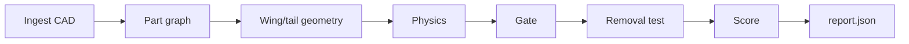

# DroneBench

DroneBench scores small electric fixed-wing UAV designs, checks they fly, and explains every part. It never suggests changes — an outside agent (e.g. Claude Code) edits the design and re-scores to climb.

Full spec: [PRD.md](PRD.md)

## What it does

Give it a `design/` folder (CAD + BOM), pick a scoring preset, and it returns a `report.json`: an overall score, a pass/fail gate, and a per-part breakdown that says what each part does, whether it's `required`/`helpful`/`unnecessary`, and where every value came from (`bom`, `cad`, `computed`, `inferred`, or `assumed`).

- **In scope:** electric fixed-wing aircraft, 1–3 m span. Reference design: Titan Dynamics Falcon V2.
- **Out of scope:** design suggestions, supplier/price lookup, cost, agent training.

## Design folder layout

```
design/
  cad/          # STEP, STL, 3MF, OBJ or GLB; one body per part
  bom.yaml      # part info, one entry per CAD body
  mission.yaml  # locked payload parts + preset
```

## Usage

```bash
dronebench score design/ --preset endurance   # report.json to stdout, appends runs.jsonl
dronebench parts design/                       # per-part report only
dronebench view  design/                       # three.js viewer, parts colored by necessity
```

```python
env = DroneBench("design/", preset="endurance")
obs = env.reset()
obs, reward, done, info = env.step(edit)   # reward = score change
```

## Scoring presets

| Preset | Score (higher is better) |
|---|---|
| endurance | minutes at best-endurance speed |
| range | km at best-range speed |
| speed | max level speed, km/h |
| payload | payload mass / all-up mass |
| efficiency | km per Wh at cruise |

Score is physics-only and uncapped, but 0 if the design fails the gate — a fixed set of pass/fail checks (static margin, stall margin, climb rate, spar safety factor, tail volume, servo torque, current ratings, wiring chains, payload presence, clearance). See [PRD.md](PRD.md#score-and-gate) for the full table and limits.

## How it works



Physics is analytic (under 100 ms/run): drag polar + induced drag for aero (XFOIL/UIUC polars, AVL neutral point), a motor/prop/battery model for propulsion, and a cantilever-beam spar for structure. Every result carries a ±15% error band, calibrated against the Falcon V2 (3.5 kg → 1.6 Wh/km ±15%).

Each part's necessity is found by a removal test: drop the part (or fastener group), rerun gate + score, and see what breaks.

## Build order

1. Ingest + part graph
2. Wing/tail geometry extraction
3. Physics + Falcon V2 calibration
4. Gate
5. Score + presets
6. Removal test
7. Report JSON + CLI
8. Viewer
9. `TASK.md` + demo loop
10. Agent-supplied-part checks

## Open items

- Falcon V2 original files are no longer on Titan's site — fallback is a parametric Falcon-style model in CadQuery.
- Wing planform from chords alone gives 0.33 m² vs published 0.45 m² — need the manual's drawing.
- Watch for agents gaming the score by adding parts (e.g. more battery); add a penalty only if it's actually seen.

## Sources

Falcon V2 specs (air-rc.com) · Falcon V2 user manual
