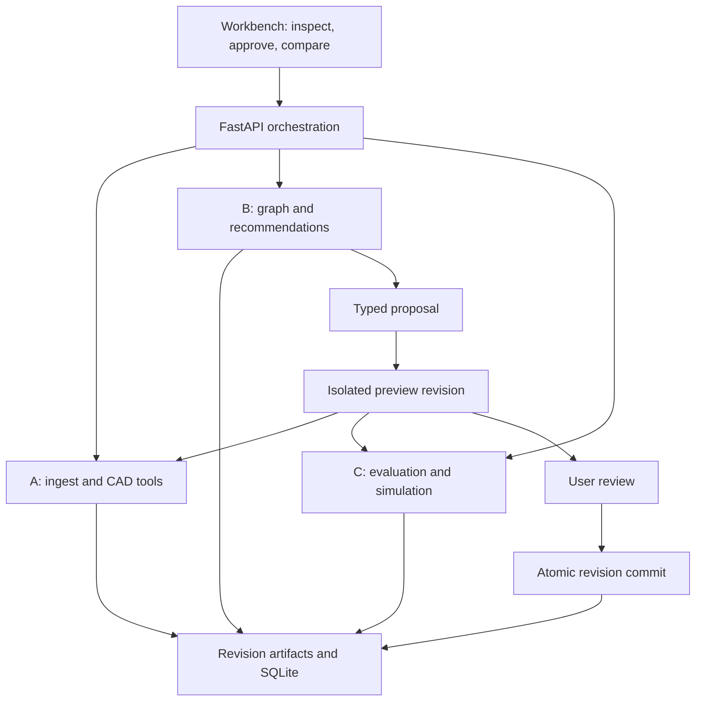
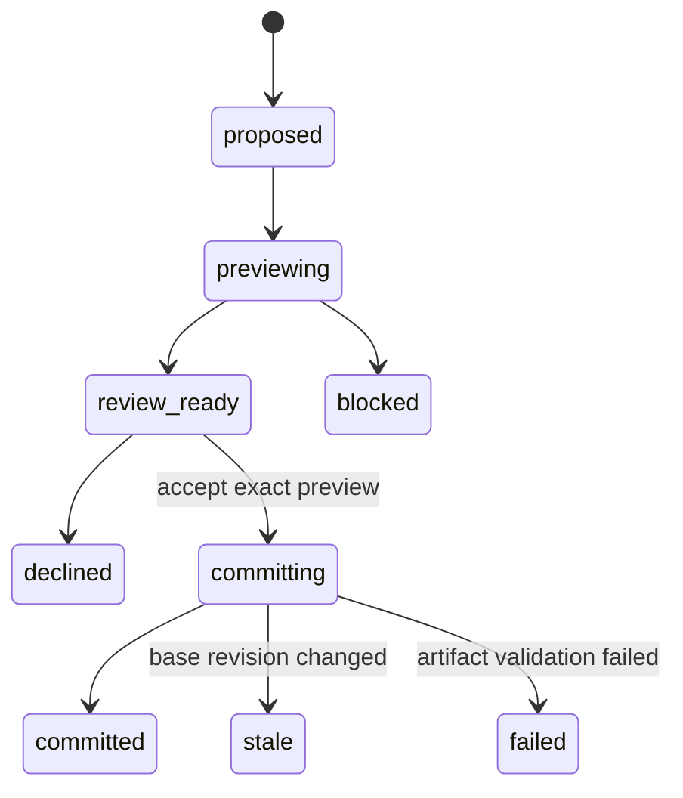

# DroneBench Studio — final build architecture

Version 1.0 · 19 September 2026 · Implementation handoff for three teammates using Claude Code

## 1. Decision and product promise

Build a local-first engineering design workbench: **import → inspect evidence → trace dependencies → propose a bounded change → preview its consequences → accept or decline → export a new STEP assembly → compare simulation runs.** Keep DroneBench as the deterministic evaluation engine inside that product. Agents explain and propose; typed tools calculate and edit.

The hackathon story is: “Click a part, see why it matters, change it with evidence, and watch the same design revision flow through CAD, analysis, and a flight visualization.” The impressive feature is traceability across that entire loop. A large graph or a cinematic flight alone does not establish that loop.

**Recommended scope:** small electric fixed-wing aircraft; one curated Avenger reference import; one explicitly reconstructed, parameterized aircraft; two real geometry operations; one real OpenVSP/VSPAERO analysis; a browser simulation replay; accept/decline and revision history. Treat Gazebo, arbitrary shape editing, VTOL transition, universal material inference, and agent training as extensions after this loop works.

Assume a 36–48 hour hackathon, three developers, one Linux x86-64 integration machine, and local browser presentation. These are planning assumptions, not requirements inferred from the source files. For a shorter event, follow the cuts in §15. This packet specifies a viable implementation; it does not claim the product or OpenVSP integration has already been built.

## 2. What the supplied files actually support

`cll.md` describes a scorer that explicitly excludes recommendations and suppliers. Your requested product includes both. Retain the scorer boundary but add the missing workbench, evidence graph, recommendation service, edit transaction service, and visualization. `gemini-code-1789848884881.md` supplies collaboration and verification conventions; keep scoped tasks, plans, evidence of completion, and lessons after corrections. Do not turn those into recurring permission prompts for routine implementation.

The attached Titan archive was inspected directly. It contains **24 binary STL files, 580,404 triangles, 11,241,502 compressed bytes, and 29,022,216 uncompressed file bytes**. All 24 binary STL lengths match their declared triangle counts. This is a format check, not a manifoldness or assembly validation. See `evidence/archive_inventory.json` for hashes, bounds, sizes, and every filename.

| Finding | Consequence |
|---|---|
| No STEP, feature history, BOM, mission, or assembly manifest | No claim of recovering the manufacturer's editable CAD or aircraft configuration |
| Three `wing3` variants: 12 mm hole, 16 mm hole, no hole | Select one variant before instancing the left/right wings |
| Three `fuse3` variants: ordinary, belly camera, clean | Select one; do not count overlapping alternatives as installed mass |
| Wing/tail meshes predominantly on positive native X; fuselage near X=0 | Likely one side provided for mirroring; confirm in viewer |
| Sections have consistent seams: wing segments near X=308.09, 548.09, 788.09, 1028.09 | Source positions appear useful; preserve them before applying any “auto assembly” |
| Wingtip reaches native X≈1112.25; fuselage Y≈−403.07 to +588.18 | If units are mm and mirrored about X=0, span≈2.2245 m and fuselage length≈0.9913 m; these are hypotheses |
| `High Temp PETG or ABS or ASA/` folder | Evidence of suggested choices, not proof which material was used |
| No motors, batteries, spars, avionics, wiring specification, or VTOL system definition | Add separately identified BOM entries/envelopes; do not infer complete hardware from the archive name |
| No license document inside this ZIP | Keep original asset external to a public starter repository until reuse terms are established |

**Two geometry representations are mandatory.**

1. **Reference representation:** original STL meshes, kept byte-identical, rendered with an assembly sidecar. Useful for inspection, part selection, and measurement. Mesh-only parts are marked `reference_mesh`, with no topology-edit capability.
2. **Editable representation:** a deliberately authored CadQuery aircraft assembly using measured/confirmed planform plus simplified fuselage, V-tail, spar, battery, and mounts. Mark every reconstructed part and report its fit error. Export this representation to STEP. It is an engineering reconstruction of the reference, not the original Titan STEP.

Show a persistent mode label: **Original mesh reference** or **Editable reconstruction**. Use a translucent overlay to show approximation. Put the same label in download filenames and metadata. Never export a generated spar by itself and present that as a complete updated Titan aircraft. For mesh-only input, a selected-component STEP export is valid only when explicitly named “component export.” The full-demo export must contain the entire supported editable assembly.

For future native STEP inputs, use a separate B-rep import lane with supported direct operations. Exchange CAD generally does not restore an author's parametric feature history. CadQuery documents its supported exchange formats and assembly export behavior; OCP/XDE is the escape hatch for STEP assembly structure and labels. [CadQuery exchange documentation](https://cadquery.readthedocs.io/en/latest/importexport.html), [Open CASCADE STEP guide](https://occt3d.com/dev/doc/overview/html/occt_user_guides__step.html).

## 3. Corrections to the tentative specification

| Original assumption | Final rule |
|---|---|
| Every material/spec must be filled, even from CAD density | Unknown is a first-class result. Geometry alone does not determine density, chemistry, infill, winding material, or supplier |
| Volume/mesh centroid gives aircraft mass/CG | Use measured/BOM mass; use geometric centroid only under an explicit mass-distribution assumption |
| Every contact reveals a bolt/bond/hinge | Store geometric proximity as inferred; require BOM/manual confirmation for functional connections |
| One `confidence: 1.0` for a whole part | Every claim has its own source, evidence reference, status, and optional confidence |
| Universal gate and score=0 on any failure | Mission/profile-specific checks with pass/fail/unknown/not-applicable; retain diagnostic metrics even when objective is infeasible |
| Fixed ±15% error band | No blanket accuracy claim. Propagate documented input ranges and disclose omitted physics; validate against independent data later |
| Falcon V2 example calibrates Avenger | Keep them separate aircraft. The source's 1.6 Wh/km target is an unverified Falcon assertion, not an Avenger acceptance criterion |
| AVL + XFOIL + VSPAERO + Gazebo all in v1 | VSPAERO for aerodynamic analysis; analytic mission model; browser replay. Add other solvers only for a concrete missing capability |
| Any score gain after removal means “unnecessary” | “Not required by modeled constraints”; missing redundancy, manufacturing, or load-path knowledge prevents removal recommendations |
| Clamp unrealistic supplier/agent claims | Reject or quarantine inconsistent inputs and retain raw values. Never silently alter evidence |
| CAD volume overrides claimed mass | Volume is not density, especially for printed shells, motors, or battery envelopes |
| 30 autonomous edits make the demo | Three intelligible proposals, sequential review, one rejection, two commits, honest before/after runs |
| FAA rule is a per-part ≥250 g flag | Regulatory applicability belongs to aircraft + operation + jurisdiction; link affected equipment to it |
| OpenVSP is a flight plant or bench test | It builds aircraft geometry/analyses. A dynamics model is a separate plant. Synthetic replay is not physical bench testing |

## 4. Architecture and runtime

Use a **modular Python backend, one web app, and isolated native-tool workers**. Three developers do not need three independent APIs, three databases, or a distributed agent framework.



**Stack choices:** Python 3.11 integration target; FastAPI + Pydantic v2; SQLite with WAL and foreign keys; NetworkX `MultiDiGraph` projection for dependency queries; CadQuery/OCP in a CAD worker; NumPy plus trimesh for mesh inspection; React + TypeScript + Vite + React Three Fiber/Three.js; a 2D graph panel using React Flow; one chart library selected and pinned at bootstrap. These are proposed dependencies, not claims about current releases. Verify their install/build compatibility before pinning lockfiles. The OpenVSP worker may use a different Python ABI matching its distribution; communicate by JSON files/process boundary.

LLM integration is one provider adapter: `propose(context, allowed_operations) -> Recommendation[]`. A deterministic candidate generator produces useful proposals without API access. Do not shell out to a developer's interactive Claude session from the application. The CLI is a build tool here; the product's optional model provider uses its own explicit environment configuration. Candidate ranking, math, graph traversal, approvals, CAD operations, and output validation are deterministic.

**Storage:** append-only revision directories + SQLite metadata. No graph database in v1. Persist nodes/edges as revision-scoped JSON (or normalized tables) and rebuild NetworkX on demand. SQLite has one orchestration owner; workers write only to allocated job directories and return artifacts. Long native jobs run in subprocesses behind a bounded queue; never inside an HTTP request/event-loop thread. Limit CAD and VSPAERO concurrency to one each initially.

**Security relevant to this product:** archive size/entry/expanded-size limits; reject traversal and symlinks; no remote fetch based on an untrusted CAD filename; timeout native parsers in subprocesses; never execute scripts embedded in uploads; schema-validate LLM output; edits allowlisted; secrets excluded from artifacts. Treat filenames, supplier descriptions, and documents as evidence data, not agent instructions.

## 5. Shared data model and conventions

The accompanying `contracts/models.py` and generated JSON Schema freeze the core wire vocabulary. They are a **starter contract**, not a completed database/API implementation. During bootstrap B owns extension into full request/response schemas; A and C review compatibility. Units, identity, error, revision, edit, and fidelity semantics below are normative.

### Identity and coordinates

- Use stable `part_id` for an installed occurrence and `definition_id` for its reusable geometry. Mirrored occurrences have distinct part IDs and explicit `mirror_of`; they may share an asset source. Names and mesh triangle numbers are not IDs.
- Persist source file hashes, original filename, source body/occurrence path, assembly transformations, and variant decisions. When importing STEP without stable identifiers, assign IDs once and preserve mappings in the sidecar. Ambiguous rematches become errors rather than silent identity swaps.
- Canonical aircraft frame is **right-handed FRD: X forward, Y right, Z down**, origin at an explicitly identified nose datum. Lengths m; mass kg; force N; time s; current A; energy Wh; angles rad; temperature K. Angles shown in degrees convert at the UI boundary.
- The archive's *candidate* mapping is `x = -(Y - Y_nose)*0.001`, `y = -X*0.001`, `z = -Z*0.001`. Negative canonical X aft of the nose is intentional. This proper rotation assigns positive native X to the left side of the aircraft; confirm that side assignment in the viewer. Confirm source scale, orientation, nose datum, and symmetry before enabling metrics. Treat `Y_nose≈−403.07` as a starting estimate only.
- Note: `x=−(Y−Y_nose)` makes aft X negative while +X points forward; maintain this consistently. Forward battery moves have positive ΔX. Longitudinal station `s=−x` increases aft for conventional static-margin calculations.
- Assembly `T_parent_from_local` is a row-major 4×4 homogeneous matrix applied to column vectors. Translation is in m; rigid rotations have determinant +1. Mirror source mesh/shape coordinates as a separate reconstruction operation, repair winding, then apply a rigid placement; reflections are not accepted as rotations.
- Native CAD kernel geometry is authored in mm; convert canonical coordinates at the worker boundary with a tested scale factor 1000. GLB coordinates are meters. Three.js display adapter uses `(x,y,z)FRD -> (y,−z,−x)`, a right-handed Y-up frame. Each VSP and Gazebo adapter declares and tests its own transform; do not assume matching axes.

### Claim-level evidence

A claim includes `value | null`, `unit`, `status`, `source_kind`, `evidence_ids`, optional `confidence`, and `assumptions`. `status` is known/estimated/unknown/conflicted. `source_kind` is cad/bom/manual/catalog/computed/inferred/assumed. Unknown values stay null; they are not zero and carry no numerical confidence. A model-derived confidence is not a statistical probability unless calibrated.

Evidence entries identify source URI/path, access timestamp, source content hash when available, locator (page/table/field/body), extraction method, and any validity interval. Conflicting claims are preserved with an explicit selected value and rationale. Prefer measured/user-confirmed values over inferred ones; do not automatically let a lower-quality recent source override measured evidence.

Printed-part mass requires measured mass or slicer/process evidence; a filled bounding envelope is never “plastic volume.” A geometric centroid is labeled as such. Each part carries `local_com_m` with evidence/assumptions, separately from its placement; calculate aircraft COM as `R × local_com_m + translation`. A placement datum is not automatically the center of mass. Missing mass distribution/COM makes relevant CG results unknown unless an explicit approximation is selected. Battery/motor CAD envelopes can be solids for visualization while their mass remains a separately sourced BOM quantity.

### Revision and artifact identity

`design_id` groups immutable `revision_id`s. A revision records parent, content hash, mission hash, artifact list, and creation cause. Every report, recommendation, simulation result, graph, GLB, STEP, and SSE event carries a revision ID. Hash immutable inputs in canonical sorted JSON plus source bytes; ignore display-only timestamps in content hashes. Each artifact has a relative path, SHA-256, media type, representation, and associated part IDs.

A revision can be a draft, staged preview, or committed revision. Content does not mutate after creation. Do not embed an artifact's own hash inside the bytes whose hash it is; keep checksums in the enclosing manifest. Sidecars accompany STEP because file labels alone are insufficient for identity.

### Core boundary artifacts

| Artifact | Producer → consumer | Required meaning |
|---|---|---|
| `design_manifest.json` + `parts.json` | A → B/C | Installed occurrences, source mappings, mass claims, transforms, edit capabilities |
| `geometry_features.json` | A → C/B | Confirmed frame, wing/tail stations, reference areas, CG inputs, quality/fit limits |
| `graph.json` | B → UI/recommender | Typed nodes/edges, evidence, unknown relationships |
| `recommendations.json` | B → review UI | Base revision, typed operation, prerequisites, rationale, evidence, preview status |
| `evaluation.json` | C → B/UI | Metrics, check statuses, fidelity, assumptions, run input hashes |
| `cad_edit_result.json` + STEP/GLB | A tool called by B → all | Validated geometry, stable part map, affected part IDs, round-trip checks |
| `simulation_run.json` + telemetry | C → UI | Exact revision, solver manifest, flight-model tier, logs and trace |
| `revision_manifest.json` | B → all | Coherent artifact set that became active atomically |

## 6. Team A — extraction, reconstruction, and CAD execution

A owns `packages/ingest`, `packages/cad`, the source importer, edit kernels, STEP/GLB export, and `apps/web/src/features/cad`. B owns the recommendation/approval workflow but **calls A's CAD tools**. This avoids B having to implement geometry kernels while also integrating the entire product.

### Ingestion sequence

1. Hash and stage the upload; enumerate parts without applying variant or mirror assumptions.
2. STEP lane: OCP reader, report units, collect bodies/occurrences and colors/names if present, tessellate for display. STL lane: load each mesh, report bounds, triangle count, finite vertices, connected components, watertightness, normals, and degeneracy.
3. Preserve source coordinates. Show three confirmation controls: units, axes, variant selection. Add a mirror-instance preview for curated Avenger wing/tail parts. Guessing can initialize the controls but cannot silently confirm them.
4. Emit one occurrence per installed part, with selected alternatives excluded. Add missing bought-component envelopes from a curated, explicitly labeled demo BOM.
5. Extract basic geometry deterministically. Use name/folder rules for initial semantic labels; optional LLM suggests function/material hypotheses from compact descriptors and evidence, never raw triangle dumps.
6. For the supported aircraft, fit spanwise wing stations, outline chord/sweep/dihedral, and tail orientation. Use the projected lifting surface/envelope to avoid counting upper/lower skins or adjacent print sections as independent wings. Map ailerons to their parent surface to avoid double area.
7. Airfoil identification is optional and tentative. Pick a declared assumed airfoil when no reliable match exists. Do not claim an exact UIUC match from a noisy hollow printed section.
8. Author the editable surrogate with explicit parameters; export baseline STEP and GLB, overlay the reference, quantify silhouette/station deviations, and require a recorded “reconstruction confirmed” decision before engineering comparison.

### Minimum editable parameterization

`wing_stations[{span_y_m, leading_edge_x_m, chord_m, z_m, twist_rad}]`, left/right occurrence symmetry, fuselage station envelopes, V-tail panels and cant angle, spar span/outer diameter/inner diameter, battery dimensions/mass/placement, motor/prop envelopes. Keep a fixed editable subset; holes, latches, skin internals, and all printed mating details are not automatically reconstructed.

V-tail matters: this archive is not a conventional horizontal-plus-vertical-tail aircraft. Model two canted panels. Tail-volume heuristics may be informative with effective projections, but a conventional-tail pass/fail template is not applicable unchanged.

### Supported edit operations

| Operation | Target/preconditions | CAD effect and recalculation |
|---|---|---|
| `translate_component` | Unlocked movable battery envelope; travel corridor, harness allowance, mount positions known in demo fixture | Change instance placement; recompute CG, clearance, trim/power model; invalidate placement artifacts |
| `resize_spar` | Reconstructed tubular spar; material assumption declared; shaft/wing-hole/connector limits known | Regenerate tube and compatible generated mounts if included in the typed transaction; recompute volume, mass, stress, deflection, CG |
| `set_wing_tip_extension` — stretch | Parameterized symmetric tip; bounded span and joint model | Regenerate paired surfaces; recompute planform, structure, aero geometry and VSPAERO results |
| `replace_catalog_component` — stretch | Dimensions, mounting, electrical limits, mass and evidence available | Replace an envelope/part and BOM atomically; unresolved fit or current checks block commit |

A proposal can contain multiple low-level edits only when they form one reviewed logical transaction, e.g. symmetric spar resize with both compatible mounts. V1 starter contract restricts proposals to one bounded high-level operation; that operation may deterministically update its owned symmetric occurrences. Never interpret arbitrary LLM Python, CadQuery, or shell as an edit.

### Export acceptance

Keep the original immutable. Write to a temporary revision. Check every solid with the kernel; verify part counts, finite positive volume where applicable, unchanged-part signatures within tolerance, requested parameter changes, and exact intent of transforms. Export assembly STEP without fusing distinct parts. Reimport it in a fresh worker; check solids, bounds, placements and sidecar identity coverage. Do not require entity numbers or face ordering to remain stable. Compare semantic geometry, not STEP byte hashes.

Collision checks distinguish intended mating engagement from unintended interference. Declare allowed contact/overlap pairs; fasteners, bonded joints and nesting geometry must not trigger a universal no-overlap failure. Check propeller swept volumes against the airframe. Unknown retention, harness or structural interfaces block verified movement claims.

Initial tolerances: 0.1 mm placement/bounds and relative solid-volume difference ≤1e−4 for the generated fixture, with a small absolute tolerance near zero. These are demo validation settings, not manufacturing tolerances. Test on baseline geometry before freezing. Export `updated_reconstruction.step`, `part_map.json`, `bom.json`, `changes.json`, and the report together. Download requires a successful round trip.

## 7. Team B — evidence graph, proposals, revisions, and shell

B owns `packages/graph`, `packages/recommend`, `packages/workflow`, `apps/api`, the database/migrations, top-level app shell, graph/review/history panels, contracts, and integration. Keep the UI assembly light; A and C supply their own feature components.

### Graph semantics

Node types: PartOccurrence, PartDefinition, Material, Function, Interface, CatalogItem, Supplier, Constraint, Regulation, Mission, Evidence, AnalysisRun. Use typed relations such as `instance_of`, `made_of`, `performs`, `mates_with`, `powers`, `controls`, `compatible_with`, `offered_by`, `constrained_by`, `applies_to`, `supported_by`, `evaluated_in`.

Each edge carries evidence, status and revision scope. Separate `near` from `mates_with`; neither proves load transfer. `compatible_with` is calculated from declared interfaces, never from a graph's visual proximity. Signal and power networks are distinct: receiver → flight controller signal, controller → ESC control, controller → servo signal; battery → power distribution → ESC/regulated avionics power. Do not treat FC→RX as a universal physical chain.

Useful queries are narrow: What evidence supports this part's mass? What fails if this battery moves? Which components are affected by a larger spar? Which supplier alternatives actually fit? Why is this rule applicable? Compute affected constraints with typed traversals; do not send the entire graph to the model.

### Supply-chain and regulatory MVP

Use a tiny checked-in catalog snapshot (roughly 6–12 items across batteries, spars, and servos). Each offer includes source URL, source timestamp, currency, quantity basis, region and known/unknown stock/lead time. If no verified data is available, use clearly labeled synthetic demo entries with no implied real supplier offer. Do not fabricate product availability, origin or price. Live supplier search is optional and never required for the stage demo.

Regulatory scope is one jurisdiction/operation profile chosen in mission setup. Return `applies`, `does_not_apply`, or `unknown` with evidence and missing context. For US Part 107, aircraft registration is not governed by a blanket 250 g exemption; that exemption belongs to qualifying recreational operation. Remote ID generally follows whether registration is required or the aircraft is registered, with operational exceptions such as FRIAs and authorized deviations. Do not infer compliance from a CAD box labeled “Remote ID.” Check equipment declarations and operation facts. [FAA registration](https://www.faa.gov/uas/getting_started/register_drone), [FAA Remote ID](https://www.faa.gov/uas/getting_started/remote_id).

Regulation flags explain design/operation constraints and missing evidence. They do not certify the aircraft. Exclude broader export-control, procurement-origin and jurisdictional compliance systems from v1.

### Recommendation pipeline

1. Load exact revision, mission, confirmed evidence, checks, editable capabilities and catalog subset.
2. Generate bounded candidates from failing checks and typed dependency paths. Examples: battery forward within corridor; thicker compatible spar within weight budget; ask for missing battery mass before promising endurance.
3. Optional LLM turns those candidates into concise explanations and may propose within the same operation schema.
4. Validate schema, target IDs, base revision, locks, bounds, units, evidence and solver availability.
5. Stage each selected candidate and calculate actual preview results through A and C. Never substitute an LLM's predicted gain for computed results.
6. Rank feasible candidates by a mission objective under uncertainty, feasibility recovery, and implementation cost; present all tradeoffs. If no candidate is evaluated, label it “unevaluated proposal.”
7. Show accept and decline. Only acceptance of a verified preview requests commit.

Initial candidate budget: ≤6 candidates, ≤3 displayed, ≤2 LLM calls for a proposal refresh, ≤3 expensive native analyses queued at a time. Candidate-only analytic screening may cover more combinations cheaply. These are application limits, not claims about provider pricing. Cache by content and model/solver versions. No multi-agent debate or repeated model calls on unchanged evidence.

### Transaction/state machine



A preview is a concrete immutable child revision with checked geometry, reports, change list, and a content hash. Acceptance includes proposal ID, expected active revision, preview hash and idempotency key. B uses compare-and-swap inside a database transaction; only then switches the active revision pointer. A failed/stale commit cannot leave a half-applied CAD/BOM/report combination. Approval of one preview does not authorize recalculating a different edit after another commit. Regenerate/review later proposals against the new active revision.

Decline logs a decision without changing design hashes. Undo switches to an existing validated revision (or records a new revision referencing those same artifacts); it does not ask an LLM to invent an inverse edit. Every mutation emits an auditable event, but events never expose chain-of-thought. They show tool name, inputs summary, artifact references, status and elapsed time.

## 8. Team C — analysis, OpenVSP, and flight visualization

C owns `packages/evaluate`, `packages/sim`, native-tool environment manifest, run artifacts, telemetry, and `apps/web/src/features/simulation`. It consumes the same geometry features and BOM that drove CAD. **No independent hand-maintained wing dimensions in simulation.**

### Three visible fidelity tiers

| Tier | What runs | What the UI may claim |
|---|---|---|
| Analytic estimate | Mass/CG, basic aero/propulsion and structure equations | “Engineering estimate — assumptions shown” |
| VSPAERO-informed estimate | Actual `.vsp3` generated from this revision, native aerodynamic solver output, separate drag/power assumptions | “VSPAERO analysis + mission model” |
| Recorded replay / optional flight dynamics | Telemetry from a declared reduced model or actual dynamics engine | “Model replay” or named dynamics solver; never “physical bench test” |

OpenVSP generates a parameterized aerodynamic model; importing a triangulated aircraft does not automatically recover a suitable VSPAERO lifting-surface model. Generate wing and V-tail geometry from the shared features, inspect normals/orientation and reference quantities, then run a small supported analysis. Preserve `aircraft.vsp3`, solver inputs, raw outputs and logs. [OpenVSP API](https://openvsp.org/api_docs/latest/), [NASA VSPAERO overview](https://www.nasa.gov/reference/openvsp-vspaero-basics/), [NASA OpenVSP import guidance](https://www.nasa.gov/reference/openvsp-file-import/).

Native builds and Python bindings are a first-hour feasibility gate. Match the binding's Python ABI and binaries; use the shipped examples for the installed build. Avoid hardcoding an unverified `pip install openvsp` or copying old analysis-input names. Record exact OpenVSP/VSPAERO versions and discover available analysis inputs at runtime. Different major VSPAERO generations have changed the interface. Isolate this worker so A/B can proceed with analytic fixtures if installation fails. [OpenVSP downloads](https://openvsp.org/download.php).

### Fast evaluator

Use locked mission payload, cruise speed, maximum takeoff mass, allowed battery bay, energy reserve, altitude/air density, load-factor assumptions, CG envelope and user objective. Report inputs and unknowns before numbers.

- `m = Σ m_i`; `r_CG = Σ(m_i r_i)/m`. Massless/missing-mass geometry does not quietly disappear; missing important masses makes CG and weight-dependent checks unknown.
- `W = mg`, `AR=b²/S`, `q=0.5ρV²`, `CL=W/(qS)` for steady level flight. Use the chosen wing reference area exactly once.
- With an explicit drag-polar approximation, `CD=CD0+k CL²`, `k=1/(πe AR)` and `D=q S CD`. With VSPAERO outputs, use returned coefficient definitions carefully. Do not add induced drag twice. Separate inviscid solver effects from profile, fuselage, interference and other drag assumptions.
- `P_elec = D V / (η_prop η_motor η_ESC) + P_avionics`, with efficiencies/curves and uncertainty declared. Voltage/current must be consistent with the electrical model. Throttle-to-thrust cannot be inferred from KV alone.
- `Wh_per_km = P_elec/(3.6 V_mps)`; `endurance_min=60 E_usable_Wh/P_elec`; `range_km=E_usable_Wh/Wh_per_km`. Check dimensions in tests.
- `V_stall = sqrt(2W/(ρS CLmax))` is an estimate only when CLmax is supported/assumed explicitly. VSPAERO linear lift behavior does not establish stall, separation or CLmax.
- Spar tube `I=π(Do⁴−Di⁴)/64`; `σ=M (Do/2)/I`; mass from declared density and actual tube volume. State load distribution, root moment model, allowable stress and uncertainty. Stress alone misses buckling, joints, adhesive and local damage; include deflection if supported and disclose omissions. No skin/spar load-sharing claim without a model.
- Static margin uses aft-positive station: `(s_NP−s_CG)/MAC`. With canonical FRD coordinates this is `(x_CG−x_NP)/MAC`. Compute neutral point only if a suitable aerodynamic stability method exists; a wing quarter-chord guess cannot turn a V-tail aircraft green.
- Climb, servos and electrical checks need thrust/power, hinge-moment and component data. Return unknown when absent. Tail-volume ranges from the tentative spec are profile heuristics, not universal certification criteria.

The mission/model profile owns a versioned required-check registry. Evaluations must include every required ID; absent checks become unknown. A proposal or LLM cannot edit that registry, downgrade a check to optional, or alter mission limits.

Every check has a class: hard editable-design invariant, modeled engineering constraint, regulatory applicability, or informational heuristic. A required unknown check prevents “verified feasible.” Geometric validity and known hard constraints block commit. A user can save an exploratory design with engineering unknowns only under an explicit draft/exploratory mode; it must not appear as a verified recommendation or flyable aircraft. For the demo, use a fully specified synthetic engineering fixture to get a verified result **within the implemented model**, while openly listing omitted validations.

### Objective and optimization

Initially support one objective: maximize estimated endurance at the locked mission cruise speed with mass/space/current/reserve constraints. Display feasibility separately from metric value; do not compare a failed design's zero with a successful design's minutes. Add range/speed/payload presets after dimensional consistency and meaningful constraints are implemented. Payload is absolute carried payload under a fixed mission, not a freely gameable mass fraction alone.

For quick candidate search, use a bounded grid or coordinate search over approved parameters. Freeze mission, payload, mass limits, solver settings and evidence versions. Evaluate baseline and candidate at identical conditions, fidelity, uncertainty assumptions and solver settings. If a newly available VSPAERO model changes fidelity, recompute both sides before showing a gain; do not subtract an analytic baseline from a VSPAERO-informed candidate. Explore low/nominal/high uncertain inputs and report a sensitivity interval; label it “assumption range,” not a calibrated confidence interval. Rank a robust lower-bound improvement only if that is what is actually computed.

Use graph dependencies to invalidate only relevant caches. Battery relocation changes CG/placement/trim/power, not necessarily the underlying fixed-geometry aerodynamic coefficient table. Spar thickness changes mass/structure and possibly trim, but not external aero if the outer mold line is unchanged. Wing edits invalidate the aerodynamic geometry. A cache hit must show reused run ID plus newly recomputed downstream results.

### Real VSPAERO minimum

Single-wing smoke model → generated baseline aircraft → baseline small alpha sweep (e.g. −2°, 0°, 2°, 4°, 6°, converted at adapter boundary) at a declared Mach/Reynolds condition → parse actual result columns → validate finite values, reference area/span/chord, positive lift slope in the attached-flow range, symmetry expectations and plausible coefficient scale. These are solver sanity tests, not flight validation. Use a slightly refined discretization at one or two points to reveal severe mesh sensitivity; record the actual difference rather than inventing a convergence result.

If stability outputs/derivatives are not reliably implemented, leave stability-dependent checks unknown. Do not add AVL in the final hours to make them green. A documented synthetic fixture may supply a neutral-point assumption for illustrating the workflow; the report must identify it as assumed.

### Plant and cinematic demo

MVP plant: a deterministic **reduced-order mission model** integrating distance and energy along a declared route at fixed altitude/speed. At each time step, compute electrical power at that operating point and update remaining usable Wh and distance. `remaining_energy_wh` means energy usable after the mission reserve has already been withheld; terminate the simulated mission at zero and mark incomplete routes as energy-limited. Never clamp the display to zero while continuing flight. Optional climb segments require an explicitly implemented climb energy model. Route turns and displayed bank omit maneuver loads/extra drag in the v1 straight-level model; state this in the run assumptions. Do not treat animated turns as a tested turning-flight envelope. Stream sampled states; the aircraft follows the prescribed route. This demonstrates estimated mission consequences; it does not show autonomous flight control, attitude stability, takeoff or stall recovery.

Browser scene: hangar/workbench for inspection; clean terrain with route ribbon for replay; matched baseline/candidate ghost aircraft; fixed mission clock; speed, altitude, energy, power, CG and constraint overlays; pause/scrub and side-by-side runs. Orient the aircraft from route tangent with a declared visual bank convention. Decorative particles/path ribbons are visual effects, not CFD streamlines. If aerodynamic forces are plotted, derive them from the actual run and label location/scale assumptions.

Gazebo is stretch. A credible dynamic plant needs mass and inertia tensors, collision geometry, frames, force/moment model including damping/control derivatives, propulsion, actuator conventions and a controller or scripted control input. A sparse CL/CD table alone is insufficient for faithful six-degree-of-freedom simulation. Use a tested fixed-wing PX4/Gazebo baseline first, then replace the model only after interface checks. This may be an additional environment, not a dependency of the primary demo. [Gazebo LiftDrag API](https://gazebosim.org/api/sim/9/classgz_1_1sim_1_1systems_1_1LiftDrag.html), [PX4 Gazebo documentation](https://docs.px4.io/main/en/sim_gazebo_gz/).

## 9. API and job contract

These endpoints are **to implement**; they are not live in this packet. All mutating endpoints return the revision or job they created. Use a shared error envelope `{code, message, revision_id, details, retryable}`; null revision is allowed before import. Suggested codes: `UNITS_UNCONFIRMED`, `ASSEMBLY_UNCONFIRMED`, `MISSING_EVIDENCE`, `UNSUPPORTED_EDIT`, `STALE_REVISION`, `GEOMETRY_INVALID`, `CONSTRAINT_FAILED`, `SOLVER_UNAVAILABLE`, `SOLVER_TIMEOUT`, `ARTIFACT_MISMATCH`.

| Endpoint | Behavior |
|---|---|
| `POST /api/designs/import` | Multipart upload; enqueue import; return 202 + job ID |
| `GET /api/jobs/{id}` | queued/running/succeeded/failed/cancelled + artifact links |
| `POST /api/designs/{id}/confirm` | Confirm units, frame, variants, reconstruction; creates a new revision |
| `GET /api/revisions/{id}` | Manifest, active status, artifact references |
| `GET /api/revisions/{id}/parts` | Parts/claims/capabilities |
| `GET /api/revisions/{id}/graph` | Typed graph or bounded neighborhood query |
| `POST /api/revisions/{id}/evaluate` | Enqueue fidelity tier with locked mission hash |
| `POST /api/revisions/{id}/recommendations` | Bounded candidate generation and optional previews |
| `POST /api/recommendations/{id}/preview` | Build isolated child, real CAD checks and evaluation |
| `POST /api/recommendations/{id}/decision` | Accept exact preview or decline; idempotent, active-revision CAS |
| `POST /api/revisions/{id}/simulate` | Create an exact-revision run; never mutate the design |
| `GET /api/runs/{id}` | Solver manifest, fidelity, warnings, telemetry/curve artifact links |
| `GET /api/events?design_id=...` | SSE events with monotonic sequence and revision/job IDs |
| `GET /api/artifacts/{id}` | Server-resolved immutable download; no arbitrary filesystem path |

SSE supports reconnect with last event ID. Progress messages are structured tool events, not guessed percent complete. Model requests and worker timeouts are cancellable. Job cache keys include revision content, mission, solver version/settings, model tier and relevant evidence/catalog snapshot hashes. Queue workers must use unique per-job directories because native solvers emit many same-named files.

CLI target: `dronebench ingest`, `confirm`, `parts`, `evaluate`, `recommend`, `preview`, `accept`, `decline`, `simulate`, `export`, `doctor`. Emit JSON on stdout and logs on stderr; nonzero exit on invalid input/tool failure; modeled infeasibility is a valid report distinguished from execution failure. Implement API and CLI through the same Python service functions.

## 10. User experience and visual direction

Build one workbench with three modes: **Inspect**, **Improve**, **Simulate**. Persistent top bar: design/revision, reference-versus-reconstruction label, model fidelity, mission, and STEP export status. Avoid scattering infrastructure names through normal product controls.

Inspect: part tree on the left, large 3D viewport in the middle, evidence inspector on the right. Selection synchronizes tree, mesh, bounded graph neighborhood and claims. Use muted neutral geometry with amber unknowns and colored selection; include text/status icons for accessibility. Provide exploded view, source overlay and measured dimensions. “Unknown mass” is actionable; make it possible to enter a value with provenance.

Improve: recommendation cards explain the specific issue, evidence, exact editable parameter, before/after modeled result, geometry diff and tradeoff. Show a ghost preview and a change ledger. Disable acceptance while preview is incomplete or stale; decline always remains available. After commit, highlight changed parts and advance the revision timeline. A proposal that increases spar margin but increases mass must show both.

Simulate: synchronized baseline/candidate replay with identical route, speed, atmospheric conditions and starting state; actual telemetry drives charts and energy bars. Show actual run time and whether coefficients were newly solved or cached. A recording fallback is visibly labeled “Recorded run” with its revision. Do not stream fake solver progress to disguise a cached result.

“Looks coolest” priority: (1) precise part picking and an attractive aircraft, (2) ghost CAD diff on approval, (3) short dependency path that lights up from part to constraint, (4) synchronized flight comparison, (5) one-click download with verified STEP metadata. These tell a coherent story within a few minutes.

## 11. Repository and ownership

```text
dronebench/
  CLAUDE.md
  pyproject.toml / uv.lock           # B owns shared dependencies
  package.json / lockfile            # B owns web root
  apps/api/                         # B
  apps/web/src/app/                  # B shell and routing
  apps/web/src/features/cad/         # A
  apps/web/src/features/graph/       # B
  apps/web/src/features/review/      # B
  apps/web/src/features/simulation/  # C
  packages/contracts/               # B maintains; A/C review
  packages/ingest/                   # A
  packages/cad/                      # A
  packages/graph/                    # B
  packages/recommend/                # B
  packages/workflow/                 # B
  packages/evaluate/                 # C
  packages/sim/                      # C
  fixtures/                         # owner subfolders; common golden fixture frozen
  tests/contract/                   # B
  tests/cad/                        # A
  tests/physics/                    # C
  tests/e2e/                        # B coordinates
  docs/decisions/                   # cross-team interface decisions
  tasks/{a,b,c,integration}.md
  artifacts/                        # ignored generated runtime files
  vendor_assets/                    # ignored externally supplied aircraft files
```

Integration begins with a common fixture, not with a final merge. B freezes the contract baseline with A/C during the first 45 minutes, commits generated types and fixture hashes, then all three branch from it. B owns contracts changes; no teammate forks a private variant. Internal Python functions use contract models. TypeScript types are generated from JSON Schema/OpenAPI; do not maintain hand-written lookalikes. Feature components consume a shared `revision_id`, selected `part_id`, artifact resolver and event interface; they do not own separate revision stores.

Use three branches/worktrees: `team/a-cad`, `team/b-workflow`, `team/c-sim`. Only B changes root dependency/lockfiles, app routing, and schema versions; A/C submit needed additions. Merge small vertical slices every 3–4 hours. Breaking contracts require a decision note, updated examples and consumer validation in the same merge. Do not wait until all three branches are “finished.”

## 12. First-hour proof and staged build order

| Time | A | B | C | Integration evidence |
|---|---|---|---|---|
| 0–1 h | Render one real STL; generate + export/reimport one solid | Freeze minimal contracts; shell + fixture endpoints | Load OpenVSP binding and run a single-wing example | All three agree frames and part IDs; native-tool pass/fail recorded |
| 1–4 h | Avenger variants/units confirmation + assembled reference view | Revision store + graph from synthetic fixture | Analytic mass/CG/endurance/structure with hand checks | Browser shows same fixture revision across all panels |
| 4–8 h | Baseline editable reconstruction + GLB/STEP + battery move | Candidate → preview → accept/decline transaction | Evaluate baseline/candidate; basic telemetry | First real edit commits and downloads valid STEP |
| 8–16 h | Spar resize, identity and collision checks | Typed evidence paths, recommendations, history, stale protection | Real generated VSPAERO baseline + parsed run artifacts | Exact-revision analysis visible; fallback tier works |
| 16–24 h | Reconstruction overlay and part inspector polish | Catalog/rules snapshot, graph/review polish | Synchronized browser replay + assumption ranges | Three-minute demo rehearsed end to end |
| 24–36 h | Fix geometry corner cases | E2E recovery and packaging | Reliability, caching; optional aero-changing edit | Restart, offline and failure-path rehearsal |
| 36–48 h | Only necessary refinements | Integration/rehearsal | Gazebo only if core is stable and owner has time | Final frozen demo fixture and recording backup |

These are timeboxes, not schedule guarantees. If OpenVSP installation fails by hour 2, move it to a dedicated known-good machine and expose a JSON worker boundary; C continues the analytic/replay lane. If no real run exists by hour 12, declare it unavailable in the demo rather than fabricating integration. If full Avenger reconstruction delays the first edit, use a simpler clearly named parametric fixed-wing fixture and retain the original Avenger in the inspection panel.

## 13. Verification and definition of done

**Contract checks:** all fixtures parse; unknowns remain null; serialization round trip preserves units and IDs; references resolve; schema mismatch fails with an actionable message. No NaN/Infinity in JSON. Revisions, missions and artifacts agree across all outputs.

**CAD checks:** archive alternatives excluded; mirrored instances explicit with repaired normals; unit/frame tests include nonzero translations; mass is not fabricated from volume; changing battery placement leaves geometry shapes intact; changing spar regenerates intended solids; original source hashes unchanged; STEP export/reimport checks pass; unsupported edit returns a typed error.

**Workflow checks:** decline changes no geometry; accept commits precisely the reviewed preview; a repeated idempotency key returns the same outcome; racing/stale acceptance returns conflict; worker failure leaves active revision unchanged; undo restores a coherent known revision; no partly updated BOM/STEP/report set.

**Physics checks:** dimensional hand cases; mass/CG closed-form two-body example; spar section moment example; increasing load increases predicted stress; same-input replay deterministic; no arbitrary claim of all improvements being monotonic (more battery may increase endurance but worsen mass/climb); unknown thrust/CLmax cannot produce passing climb/stall checks. Mission locks and budgets prevent adding unlimited battery or removing payload to game the objective.

**Simulation checks:** actual raw VSPAERO run exists for a specific geometry hash before showing the solver label; missing binary/timeout/invalid coefficients downgrade explicitly; frame and area conventions are checked; cache dependencies tested with battery-only and wing edits; telemetry finite, monotonic in time and conserves energy under the stated model; no below-zero energy or extrapolation outside the declared table without an explicit policy.

**UI/E2E:** import → confirm → select → graph/evidence → preview → decline → preview → accept → compare → export; visual selection IDs match CAD part map; candidate preview is visibly a different revision; refresh/restart recovers history; no stage-network dependency; desktop presentation verified at the actual screen size. Run one meaningful end-to-end scenario and targeted failure tests; avoid low-value exhaustive testing in the final hours.

Success means a skeptical judge can inspect an original file, trace a recommendation to sources and equations, decline without changes, accept a concrete edit, reopen the STEP, and see which run analyzed which revision. It does not mean airworthiness, regulatory approval, full reverse engineering, or validated flight dynamics.

## 14. Demonstration script (about 3–4 minutes)

1. **0:00–0:35 — Understand.** Load the actual Avenger archive. Rotate, select a wing section, show file-derived dimensions and unknown materials. Reveal variant selection and missing purchased components. Switch to the labeled editable reconstruction.
2. **0:35–1:15 — Explain.** Select the battery or spar; show one short evidence path and a failed/marginal modeled constraint in an intentionally configured demo scenario. Call it a synthetic scenario on reconstructed geometry, not a discovered defect in Titan's design.
3. **1:15–2:00 — Change.** Preview moving the battery within a modeled mounting corridor. Show CG and any model-derived trim effect. Accept; the revision advances. Preview a spar change, show stress/mass tradeoff, and decline once to demonstrate control. Then accept a valid chosen change against the current revision.
4. **2:00–2:50 — Evaluate.** Display the exact VSPAERO baseline artifact and candidate mission calculations. Battery/spar edits can legitimately reuse aero coefficients; say so in the UI. For fresh aero before/after, use the optional parameterized wing-tip edit only if it is implemented and checked.
5. **2:50–3:30 — Compare and export.** Scrub the same mission with baseline/candidate energy traces, inspect change history, export `updated_reconstruction.step` and its report. Reopen the downloaded STEP or show the automated round-trip result.

Do not promise battery relocation improves endurance if your model lacks trim drag. It may improve only a CG constraint. Do not force the spar upgrade to improve every metric. The tradeoff and the ability to decline are part of the product's value.

## 15. Scope cuts, risk controls, and next phase

| If time/feasibility is tight | Keep | Cut or defer |
|---|---|---|
| Only 12–24 h | Curated input, confirmed units, parametric fixture, two edits, approval, STEP export, analytic replay | Live suppliers, multi-presets, arbitrary CAD, Gazebo, autonomous search |
| OpenVSP unavailable | Real analytic evaluator + explicit unavailable status + artifact-ready adapter | Any claim of a completed VSPAERO run |
| Poor reference assembly fit | Reference inspection + separately named editable demonstrator | Claim that the STEP is a faithful reproduction |
| Weak materials/electrical evidence | Unknowns and synthetic example BOM | Real performance guarantees and real supplier-specific swap recommendations |
| Unstable frontend | One viewport + evidence panel + change cards + telemetry chart | Huge graph, split animated scenes, excess dashboards |

After the demo: native STEP assembly fidelity; richer reconstructable families; measured hardware catalog; airfoil/propeller datasets with licenses; independent flight/bench validation; joints/buckling/control authority; actual Gazebo or JSBSim dynamics with adequate coefficients; optimization benchmarks across held-out aircraft and missions; broader regulatory profiles. Introduce agent learning only after reward/model errors are bounded and the evaluator resists gaming. Initially log proposal → tool validation → user decision → real result and compare deterministic search against LLM-assisted proposals; that is enough to improve recommendations without claiming training.

## 16. How to hand this to Claude Code

Read `README.md`, then place `CLAUDE.md`, this architecture, team briefs, and contracts in the team repository. Run the bootstrap prompt first; it creates the agreed scaffold and pins working dependencies. Start each teammate's Claude session in their own worktree with the matching team brief. They implement against the same frozen fixture before wiring to each other's live modules.

Use short persistent repository instructions plus targeted task files and runnable acceptance criteria. Claude Code supports repository `CLAUDE.md` guidance and recommends specific verification signals and scoped context. Keep binary meshes and native logs out of model context; pass small descriptors, relevant failures and artifact paths. [Claude Code best practices](https://code.claude.com/docs/en/best-practices), [Claude Code memory](https://code.claude.com/docs/en/memory).

The build packet includes task prompts, acceptance gates, a minimal executable contract, generated schema, synthetic fixtures, actual archive inventory, and a contract/geometry validation record. **It contains architecture and starter interfaces, not a finished DroneBench application.**
